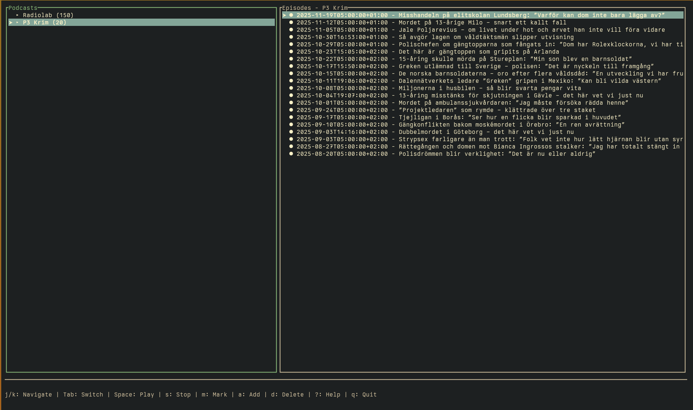
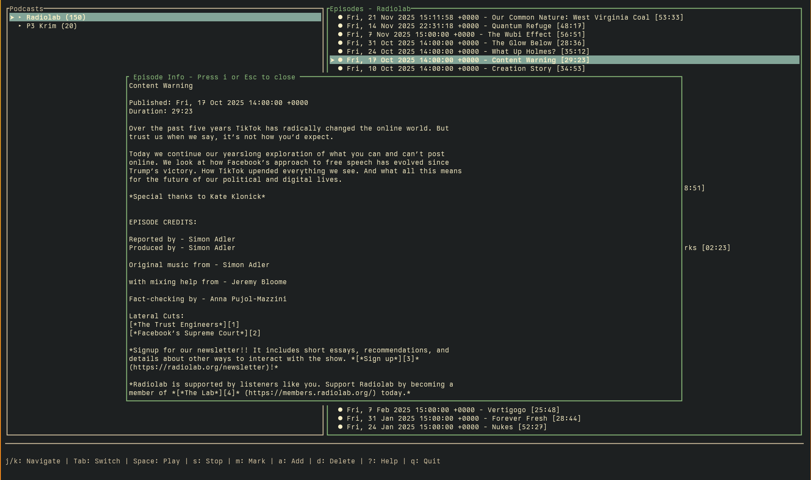
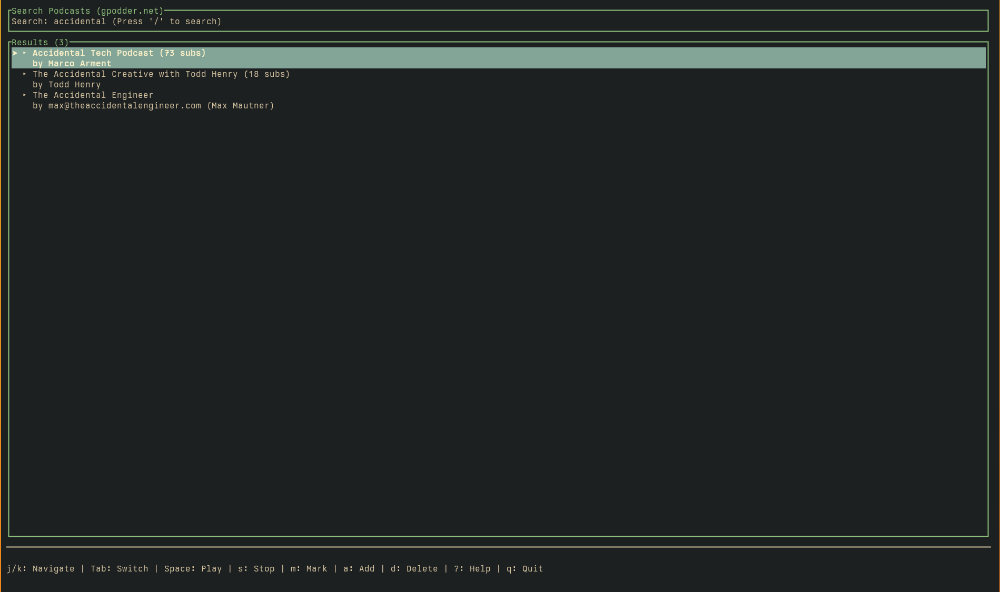
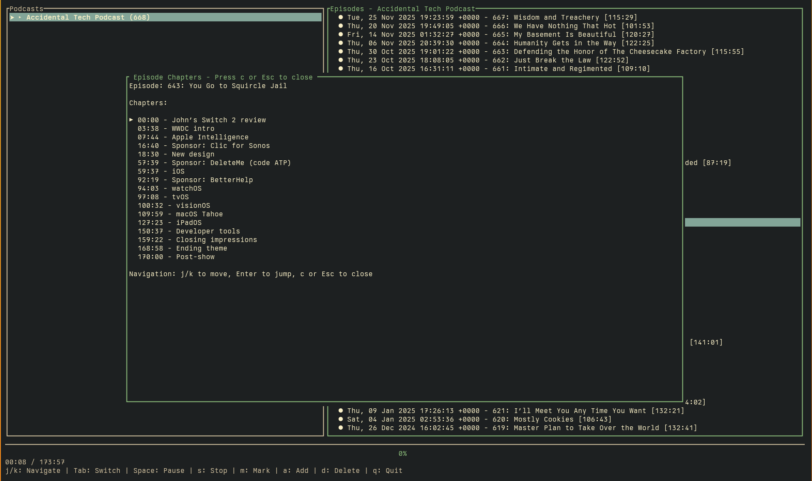

# shellcast


A terminal-based podcast player written in Rust.









## Features

- **Podcast Discovery** - Browse and search thousands of podcasts via gpodder.net (free, no API keys required)
- **Smart Deduplication** - Search results deduplicated by title and hostname, sorted by popularity
- **Feed Management** - Subscribe to podcast RSS/Atom feeds (RSS and Atom format support)
- **Episode Browser** - Browse episodes with publish dates in a clean two-pane TUI
- **Episode Info** - View full episode descriptions and metadata in popup (i key)
- **Chapter Support** - Navigate podcast chapters with timestamps (Podcasting 2.0 spec)
- **Theming System** - Customizable color themes via TOML config (default, dark, gruvbox, or custom)
- **Help Screen** - Built-in keybindings reference (? key)
- **Audio Playback** - Stream and play podcast episodes with seek controls (±30s)
- **Playback Speed** - Adjust playback speed from 0.5x to 3.0x in 0.25x increments
- **Resume Playback** - Automatically resume episodes from where you left off
- **Played Status** - Mark episodes as played/unplayed, synced to disk
- **Persistence** - Subscriptions and playback state saved automatically
- **TUI Interface** - Clean terminal interface using ratatui
- **Vim-style Navigation** - j/k for navigation, g/G for top/bottom
- **Keybindings** - Intuitive controls for all features
- **Responsive** - 50ms event polling for snappy keyboard input

## Development Status

Active development - core features implemented and working. See [CHANGELOG.md](CHANGELOG.md) for recent changes and TODO section for planned enhancements.

## Installation

### Download Pre-built Binary

Download the latest release from the [Releases page](https://github.com/ducks/shellcast/releases).

### Build from Source

```bash
cargo build --release
```

The binary will be available at `target/release/shellcast`.

## Usage

1. Run `shellcast` to start the application
2. **Discover podcasts** - Press `5` to enter Browse mode, then `/` to search
3. **Subscribe** - Press `Enter` on a search result to subscribe
4. **Manual add** - Press `a` to add a podcast feed by URL
5. Use `j/k` or arrow keys to navigate between podcasts and episodes
6. Press `Tab` to switch between the podcast list and episode list
7. Press `Space` to play an episode (resumes from last position)
8. Press `h/l` or arrow keys to seek backward/forward 30 seconds
9. Press `[/]` to decrease/increase playback speed (0.5x - 3.0x)
10. Press `m` to mark episodes as played/unplayed
11. Press `1` to return to Podcasts view, `5` for Browse
12. Press `q` to quit

Podcasts and playback status are automatically saved to `~/.config/shellcast/podcasts.json`.

## Configuration

### Theming

Shellcast supports customizable color themes. Create a config file at `~/.config/shellcast/config.toml`:

```toml
[theme]
# Use a built-in theme
name = "default"
```

#### Built-in Themes

- **default** - Classic shellcast blue theme with cyan accents
- **dark** - High contrast theme with magenta and yellow highlights
- **gruvbox** - Warm retro theme with yellow accents
- **solarized** / **solarized-dark** - Solarized dark with blue and cyan
- **solarized-light** - Solarized light theme
- **dracula** - Popular dark theme with purple and pink accents
- **nord** - Cool arctic-inspired theme with blues and cyans
- **monokai** - Classic monokai with yellow and green highlights
- **tokyo-night** - Modern dark theme with purple and blue
- **catppuccin** - Pastel theme with soft blues and purples

#### Custom Themes

For full customization, set `name = "custom"` and define your colors:

```toml
[theme]
name = "custom"

[theme.custom]
selection_bg = "blue"
selection_fg = "white"
border_focused = "cyan"
border_unfocused = "gray"
text_normal = "white"
text_played = "gray"
text_unplayed = "white"
status_bar_bg = "black"
status_bar_fg = "white"
popup_border = "cyan"
popup_bg = "black"
popup_fg = "white"
episode_title = "white"
episode_published = "gray"
```

**Color Formats:**
- **Named colors**: `black`, `red`, `green`, `yellow`, `blue`, `magenta`, `cyan`, `gray`, etc.
- **Hex colors**: `"#ff0000"`, `"#f00"`, `"5f87af"`
- **RGB values**: `"rgb(255, 0, 0)"`
- **Terminal palette**: `"0"` through `"255"` (use your terminal's theme colors)
- **Terminal default**: `"reset"`

See `config.example.toml` for a complete reference and examples.

## Testing

```bash
cargo test
```

## Development Environment

If using Nix:

```bash
nix-shell
```

## Keybindings

### Navigation
- `j/k` or Arrow Keys - Navigate up/down in lists
- `g/G` - Jump to top/bottom of list
- `Tab` - Switch focus between podcast list and episode list

### Screen Switching
- `1` - Switch to Podcasts view
- `5` - Switch to Browse/Search view

### Browse Mode
- `/` - Start searching (when in Browse mode)
- `Enter` - Subscribe to selected search result

### Playback
- `Space` - Play/pause selected episode (resumes from last position)
- `s` - Stop playback
- `h` or Left Arrow - Seek backward 30 seconds
- `l` or Right Arrow - Seek forward 30 seconds
- `[` - Decrease playback speed (min 0.5x)
- `]` - Increase playback speed (max 3.0x)

### Management
- `m` - Mark episode as played/unplayed
- `a` - Add new podcast feed (enter URL)
- `d` - Delete selected podcast

### Help & Info
- `?` - Show help screen with all keybindings
- `i` - Show episode info/description popup
- `c` - Show episode chapters (if available)
- `Esc` - Close popups
- `q` - Quit application

## TODO

### Core Features (Implemented ✓)
- [x] Feed subscription management
- [x] Parse RSS/Atom feeds
- [x] Extract audio URLs from feeds
- [x] HTTP streaming player
- [x] Episode list UI
- [x] Feed browser UI
- [x] Playback controls (play/pause/stop)
- [x] Seek controls (forward/backward 30s)
- [x] Played/unplayed tracking
- [x] Feed storage (JSON-based)
- [x] Keybindings system
- [x] Actions pattern
- [x] Persistence
- [x] **Podcast discovery and search** (gpodder.net integration)
- [x] **Smart deduplication** (by title + hostname)
- [x] **Subscriber rankings** (sorted search results)
- [x] **Help screen** (comprehensive keybindings reference)
- [x] **Episode info popup** (view descriptions and metadata)
- [x] **Publish dates** (shown in episode list)
- [x] **Chapter support** (Podcasting 2.0 chapters with navigation)
- [x] **Theming system** (TOML config with built-in and custom themes)
- [x] **Resume playback** (automatically resume from last position)
- [x] **Speed control** (0.5x - 3.0x playback speed with 0.25x increments)

### Planned Enhancements
- [ ] Better error handling and user feedback
- [ ] Episode download manager for offline listening
- [ ] Episode queue
- [ ] Episode artwork display
- [ ] OPML import/export
- [ ] Better buffering status in UI
- [ ] Podcast refresh/update functionality
- [ ] Filter episodes (show unplayed only)
- [ ] Auto-mark as played when episode finishes

## Related Projects

- [shelltrax](https://github.com/yourusername/shelltrax) - Terminal music player (sister project)

## License

MIT OR Apache-2.0
